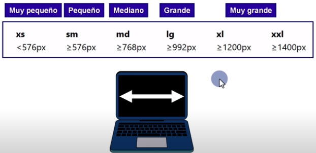
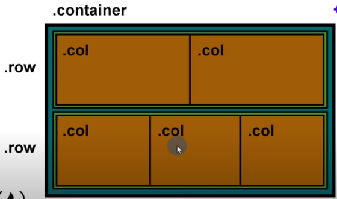
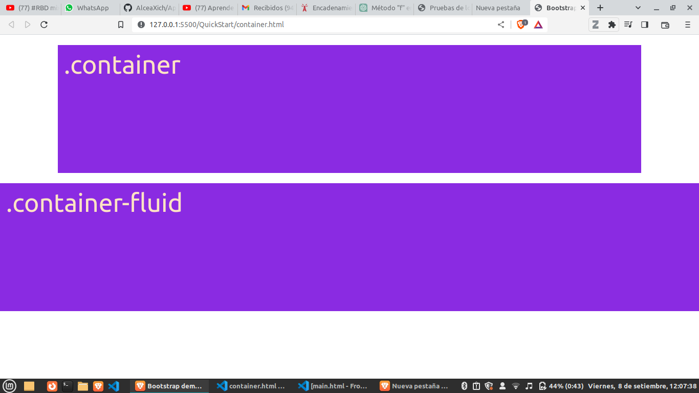

# Quick Start
## Pilares principales
- Grid
  - Cada fila tiene 12 columnas.
- Componentes(elementos html reutilizbles).
- Iconos
## Vocabulario
- **box-sizing:** indica cómo se deben calcular las medidas de un elemento.  Tiene tres valores posibles:
  - **content-box(mas popular):** Si se define el ancho de un elemento en 100 pixeles, la caja del contenido del elemento tendrá 100 pixeles de ancho, y el ancho de cualquier borde o relleno ser añadirá al ancho final desplegado.
  - padding-box(ya no existe)
  - **border-box:** le dice al navegador tomar en cuenta para cualquier valor que se especifique de borde o de relleno para el ancho o alto de un elemento. Es decir, si se define un elemento con un ancho de 100 pixeles. Esos 100 pixeles incluíran cualquier borde o relleno que se añadan, y la caja de contenido se encogerá para absorber ese ancho extra. Esto típicamente hace mucho más fácil dimensionar elementos.
  - **text-center** al agregar a una clases, centra el texto.

## Apuntes Grid de Bootstrap 5
- Cada fila esta divida en 12 columnas.
- Hay clases especificas:
  - .row
  - .col-
  - .col-sm-
  - .col-md-
  - .col-lg-
  - .col-xl-
- Dimensiones(estas dimensiones reprsentan el ancho de la ventana donde se ve la pagina web, conocido como **viewport**):
  - xs -> dispositivo $<$ 576px
  - sm -> dispositivo $>=$ 576px
  - md -> dispositivo $>=$ 768px
  - lg -> dispositivo $>=$ 992px
  - xl -> dispositivo $>=$ 1200px
  - xxl -> dispositivo $>=$ 1400px
- Las dimensiones representan un **breakpoint**. En el cual el estilo cambia. Hay 6 breakpoints.

- Estructura de la grid: un contenedor puede contener filas y cada fila contiene 12 columnas.
    
    

- Un contenedor contiene la estrutura grid o demas elementos html.
  - .container -> crea un contenedor responsivo con un ancho maximo fijo, depende del tamaño del dispositivo.
  - .container-fluid -> crea un contenedor responsivo que cubre el 100% del ancho de la ventana.
    

- Contenedores responsivos: depende del tamaño del dispositivo se realiza un punto de quiebre, es decir, si elegimos container lg y el dispositivo menos al tamaño a lg se cubrira al 100% y si es mayor se comporta como "container".
  - container-xs -> dispositivo $<$ 576px
  - container-sm -> dispositivo $>=$ 576px
  - container-md -> dispositivo $>=$ 768px
  - container-lg -> dispositivo $>=$ 992px
  - container-xl -> dispositivo $>=$ 1200px
  - container-xxl -> dispositivo $>=$ 1400px
- 